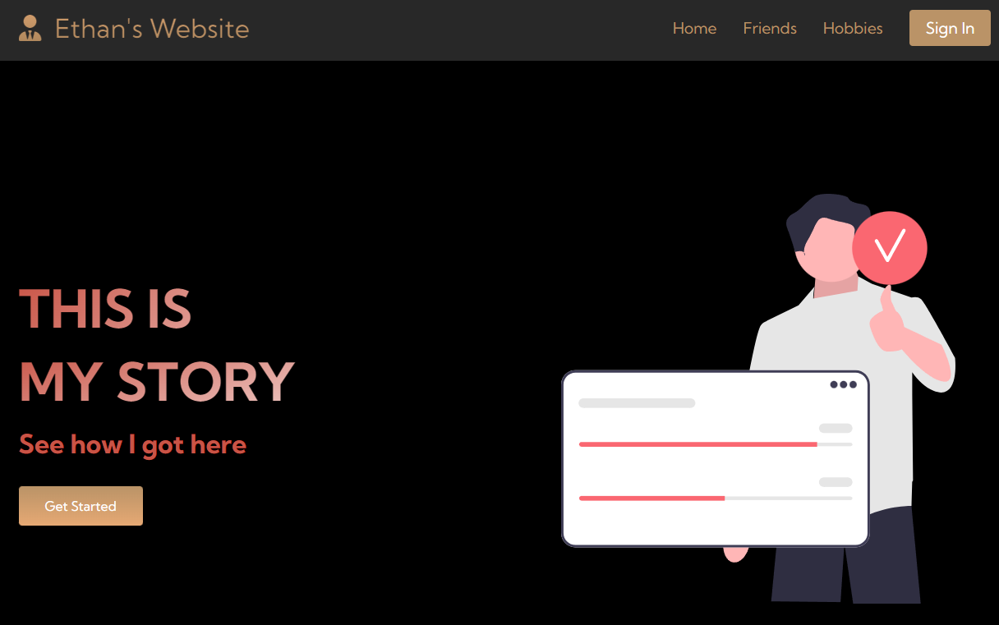
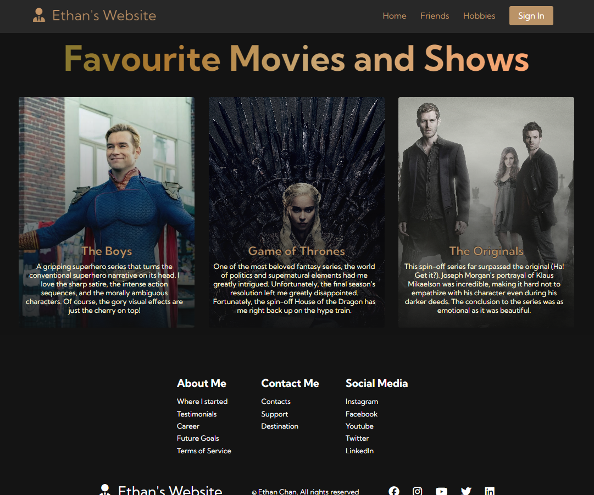

# Personal Website Project

## Overview

Welcome to my personal website! This project primarily utilizes HTML, CSS, and JavaScript to create a dynamic and visually appealing personal portfolio.

## Features

### 1. Responsive Design

- The website incorporates responsive design principles to ensure a seamless and engaging user experience across various devices.
- Key elements, such as buttons and navigation, as well as adapting to different screen sizes, demonstrate mobile-first design.

### 2. UI/UX

- Crafted with a modern and clean design, emphasizing readability and aesthetics.
- CSS features, such as gradients, shadows, and image backgrounds, enhance the visual appeal and professionalism of the website.

### 3. Interactive Elements

- JavaScript is utilized to introduce interactive elements, providing a dynamic and engaging user experience.
- For example, the signup button incorporates dynamic effects to catch the user's attention.

### 4. Image Gallery

- Includes an image gallery showcasing my friends, hobbies, and personal interests.
- Import of avatars and icons from online sources 
- Demonstrates proficiency in handling and displaying images effectively using HTML and CSS.

## Skills Demonstrated

- **HTML**: Proficient in creating structured and semantic markup for web pages.
- **CSS**: Strong styling skills, including the use of gradients, shadows, and responsive design.
- **JavaScript**: Basic proficiency in adding interactivity and dynamic behavior to web pages.
- **Image Handling**: Experience in incorporating and styling images within a web page.
- **Responsive Design**: Understanding of creating websites that work seamlessly across different devices.

## Home Page

## Hobbies Page

## Friends Page

Example of a profile on the friends page.

## Contact Information

Feel free to reach out via email at [enchan101@gmail.com](mailto:your.enchan101@gmail.com).
